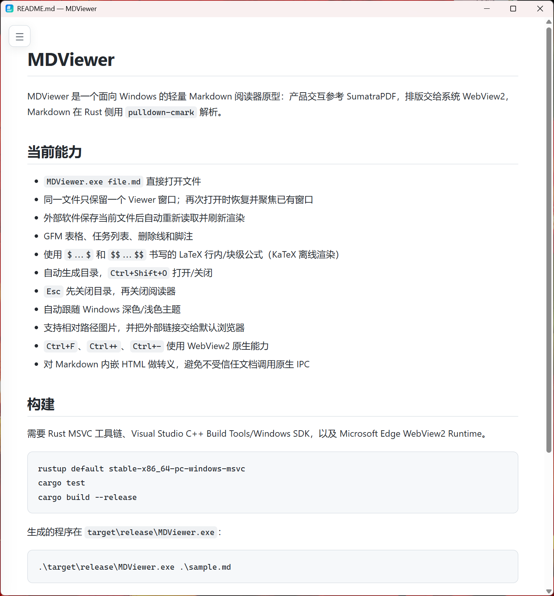

<p align="center">
  
</p>

<h1 align="center">MDViewer</h1>

<p align="center"><strong>面向 Windows 的轻量 Markdown 极速阅读器。</strong></p>

<p align="center">
  <a href="LICENSE"></a>
</p>

MDViewer 是一个专为 Windows 设计的轻量 Markdown 阅读器：交互参考 SumatraPDF 极简直觉体验，排版交给系统内置的 WebView2，底层通过 Rust `pulldown-cmark` 解析，并原生支持 KaTeX 数学公式与自动生成目录。

<p align="center">
  
</p>

## 亮点特性 (Features)

- `MDViewer.exe file.md` 直接打开文件
- 同一文件只保留一个 Viewer 窗口；再次打开时恢复并聚焦已有窗口
- 外部软件保存当前文件后自动重新读取并刷新渲染
- GFM 表格、任务列表、删除线和脚注
- 使用 `$...$` 和 `$$...$$` 书写的 LaTeX 行内/块级公式（KaTeX 离线渲染）
- 自动生成目录，`Ctrl+Shift+O` 打开/关闭
- `Esc` 先关闭目录，再关闭阅读器
- 自动跟随 Windows 深色/浅色主题
- 支持相对路径图片，并把外部链接交给默认浏览器
- `Ctrl+F`、`Ctrl++`、`Ctrl+-` 使用 WebView2 原生能力
- 对 Markdown 内嵌 HTML 进行安全白名单过滤，保留排版标签同时防止脚本调用原生 IPC

## 快速上手与构建 (Quick Start)

需要 Rust MSVC 工具链、Visual Studio C++ Build Tools/Windows SDK，以及 Microsoft Edge WebView2 Runtime。

```powershell
git clone https://github.com/yuzhounh/markdown-viewer.git
cd markdown-viewer
rustup default stable-x86_64-pc-windows-msvc
cargo test
cargo build --release
```

生成的程序在 `target\release\MDViewer.exe`：

```powershell
.\target\release\MDViewer.exe .\sample.md
```

无参数启动时会显示内置的 `sample.md`，便于快速检查排版。

## 设计边界

第一阶段只做 Viewer，不加入编辑器、多标签、Node.js、前端构建链或远程资源依赖。CSS、JavaScript 和 KaTeX 通过 `include_str!` 编译进单个 exe。WebView2 Runtime 由 Windows 提供，不随程序打包。

详细路线见 [IMPLEMENTATION_PLAN.md](IMPLEMENTATION_PLAN.md)。

## 相关项目

- [SumatraX](https://github.com/yuzhounh/SumatraX)：基于 SumatraPDF 的多格式阅读器；MDViewer 专注于 Markdown 阅读。
- [light-note](https://github.com/yuzhounh/light-note)：支持编辑、组织和搜索笔记的 Windows 应用。

## 开源协议 (License)

本项目采用 [MIT 许可证](LICENSE)。
